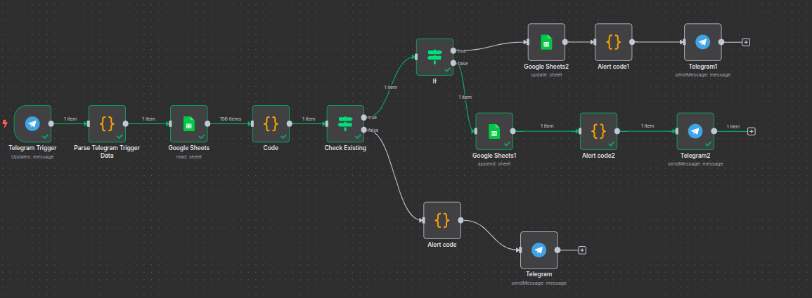
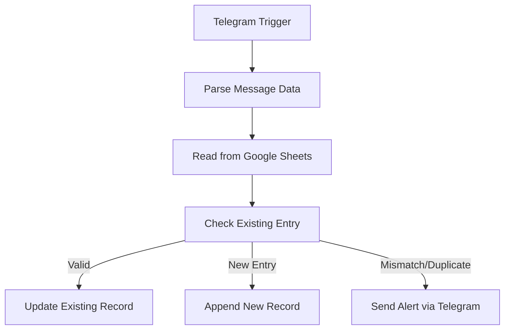

# 📦 Inventory Management System using n8n

> A smart Telegram-to-Google Sheets automation that streamlines IT asset tracking and prevents duplicate entries – built with [n8n](https://n8n.io/).

---

## 🧠 Key Features

✨ Fully automated Telegram-based asset management system  
🔍 Extracts and parses asset data from messages  
📊 Reads, updates, and appends data in Google Sheets  
🧠 Validates against existing inventory  
🚨 Alerts on duplicates or mismatches via Telegram  
✅ Built-in conditional checks and custom logic  

---

## 🚀 Tech Stack

| Tool            | Purpose                      |
|-----------------|------------------------------|
| 🔁 n8n          | Workflow automation platform |
| 📄 Google Sheets | Asset database               |
| 💬 Telegram Bot | Trigger + Notifications      |

---

## 🛠️ Workflow Overview

> A visual summary of the n8n automation:



---

## 🧩 Workflow Logic



---

## 💬 Supported Message Format

Your Telegram messages should follow this style:

```
Asset issued: LT145 SN:DTJF563 MAC:AA:CC:44:F0 Employee: John Doe ID:1122 OS:Ubuntu 22.04 Team:IT

Asset received: LT145 SN:DTJF563 MAC:AA:CC:44:F0 Employee: John Doe ID:1122 OS:Ubuntu 22.04 Team:IT

Replaced Old LT1234 Old SN-ABCD1234 Old MAC:00:11:22:33:44:55 Old OS:Windows 10 New LT5678 New SN:XYZ7890 New MAC:AA:BB:CC:DD:EE:FF New OS:Windows 11 Employee:John Doe ID:1234 Team:IT

Asset lost: LT2301 SN:HGFR789 MAC:BB:DD:45:EE Employee: Sarah Wilson ID:3344 OS:Windows 11 Team:Finance

Asset damaged: LT1234 SN:ABCD123 MAC:00:11:22:33:44:55 Employee: Mark Johnson ID:5566 OS:MacOS 12.0 Team:Marketing

```

---

## ⚙️ Code Snippets & Config Files

All custom logic is modular and reusable.

📁 `nodes-config/` folder contains:

| File                   | Description                          |
|------------------------|--------------------------------------|
| `parse-code-node.json` | Extracts structured data from text   |
| `alert-code-node.json` | Prepares human-readable alerts       |
| `check-existing-node.json` | (Optional) Custom logic for row checks |

---

## 🧑‍💻 Setup Instructions

1. **Clone this repository**  
   ```bash
   git clone https://github.com/yourusername/inventory-management-n8n.git
   cd inventory-management-n8n
   ```

2. **Upload to your n8n instance** (Cloud or Self-hosted)

3. **Add credentials** in n8n:
   - Telegram Bot Token (via BotFather)
   - Google Sheets API key or OAuth credentials

4. **Customize your sheet columns** if needed (supports: Asset Name, SN, MAC, Employee, OS, etc.)

5. **Test messages via Telegram group/chat**

---

## 📦 Folder Structure

```
inventory-management-n8n/
├── images/
│   └── workflow-architecture.png   # Workflow screenshot
├── nodes-config/
│   ├── parse-code-node.json
│   ├── alert-code-node.json
│   └── check-existing-node.json
└── README.md
```

---

## 💡 Suggestions & Contributions

Contributions are welcome! You can:
- Fix bugs or improve logic
- Add new integrations (Slack, WhatsApp, Email)
- Suggest formatting improvements or column validations

> Submit a PR or open an issue to get involved.

---

## 📜 License

This project is licensed under the **MIT License**.

---

### Made with ❤️ using n8n by [@Alok](https://github.com/Alok77it)
